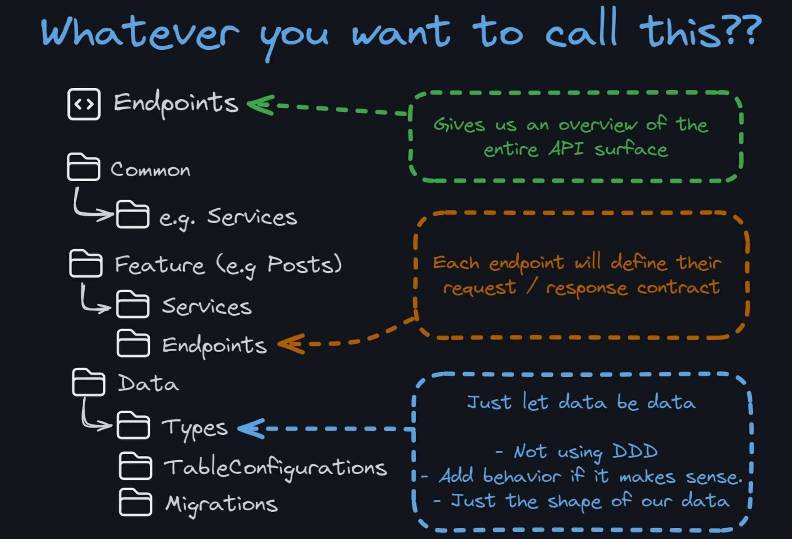

# Asp.Net Core Angular Authentication Practice

## Commands

	- `cd AuthApp.Server`
- Create Migration: `dotnet ef migrations add <MigrationName>  --output-dir Data/Migrations`
- Migrate Database: `dotnet ef database update`

## Notes and Tasks

- [] Create Payment Endpoints https://youtu.be/OZGdKYzUYvU?si=Netk-wPv7Wk9OVEV&t=1008
- https://learn.microsoft.com/en-us/aspnet/core/fundamentals/minimal-apis/security?view=aspnetcore-9.0
- [] Analyze and implement good practices from this project: <https://github.com/nikosanif/angular-authentication>

## Backend Documentation

### Used Courses and Tutorials

- Course: <https://www.youtube.com/playlist?list=PLjC4UKOOcfDQtElvsn1ZCAHatLtqDrTgQ>
	- I am not following the cousre exactly.
	- Changes:
		- Up to date frameworks
		- Angular Asp.Net Project Template
		- Different project structure
		- HTTPS
- Backend architecture: <https://youtu.be/ZA2X1gaAhJk?si=RGJY7OKtCek97xwC>
	- This is not an Onion or Clean Architecture. -> I wanted to try something smaller and simpler.

### Backend Architecture

